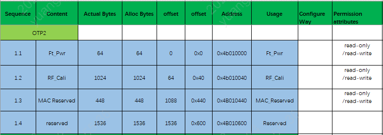
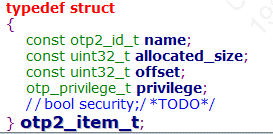
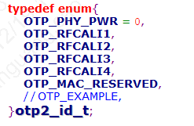
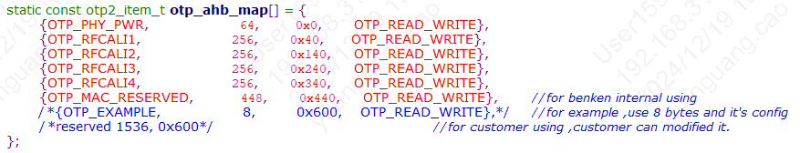

.. _bk_nosecure_version_of_otp_usage_instructions:

nosecure_version_of_otp_usage_instructions
============================================

:link_to_translation:`zh_CN:[中文]`

OTP
-----------------------------------------------------------

一、Overview
+++++++++++++++++++++++++++++

The detailed explanation of OTP, please refer to :ref:`config_otp_efuse <bk_config_otp_efuse>`.

.. note::

 Only the storage space of OTP2 is available for customer use, and the operation storage address range is [0x4B010600----0x4B010C00], which is a 1.5K byte space.

OTP2 Usage Layout
~~~~~~~~~~~~~~~~~~~

OTP2 Side
~~~~~~~~~~~~~~~~

OTP2: Readable and programmable OTP2 area, where 0x000~0x2FF is divided into 767 small partitions. Its storage address range is [0x4B010000----0x4B010C00]. Each partition can change permissions by modifying the LOCK OTP2 CELL: read/write -> read-only -> no access.

.. important::

    The first 1.5K byte space is already used internally by BEKEN, with the storage address range being [0x4B010000----0x4B010600]; this space is not available for customer use. The operable storage address range for customers is [0x4B010600----0x4B010C00], which is a 1.5K byte space.

二、Introduction to Otp2 Driver Usage
+++++++++++++++++++++++++++++++++++++++

- 1）Firstly, the driver code path for otp2 is located at bk_idk/middleware/driver/otp/otp_driver_v1_1.c;
- 2) If customers want to use otp2, they need to configure the structure array otp_ahb_map[] with { name, allocated_size, offset, privilege } accordingly;
- 3) Among these, name field needs to be added in sequence in the enumeration structure otp2_id_t;
- 4) After configuring the above settings, customers can use CLI commands to test. The related test code path is: bk_idk/component/bk_cl/cli_otp.c (for example, the test command is otp_ahb read item size)

Structure Array otp_ahb_map Configuration Introduction
~~~~~~~~~~~~~~~~~~~~~~~~~~~~~~~~~~~~~~~~~~~~~~~~~~~~~~~

- 1) The structure of the structure array otp_ahb_map is as follows: specific path is bk_idk/middleware/driver/otp/otp_driver.h

.. note::

    - name: item_id of the access area, subsequent operations on this area can be accessed according to this item_id; d_size indicates the required allocated byte size space;
    - allocated_size: allocated byte size space
    - offset: offset from the base address
    - privilege: set the permissions of the access area

- 2) Corresponding name fields can be added in sequence in the otp2_id_t structure; specific path is include/driver/otp_types.h

- 3) Currently, the usage area of otp2 is as follows: specific path is bk_idk/middleware/driver/otp/otp_driver_v1_1.c

.. note::

    - Taking name=OTP_EXAMPLE as an example to introduce how to configure otp2,
    - Firstly, add a self-defined name field such as OTP_EXAMPLE in the otp2_id_t structure;
    - Secondly, configure the size of allocated_size, that is, the required allocated byte size space; (in decimal size)
    - The offset size equals (the allocated_size of the previous name field + the offset of the previous field) (in hexadecimal)