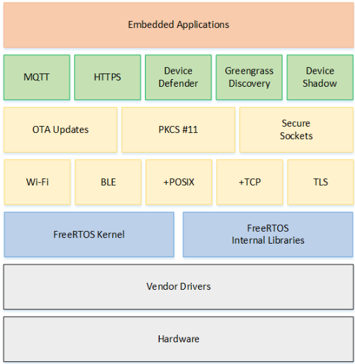

FreeRTOS
===============================

:link_to_translation:`zh_CN:[中文]`

Introduction to FreeRTOS
--------------------------

  - FreeRTOS is a mini real-time operating system kernel.
  - As a lightweight operating system, its functions include: task management, time management, semaphores, message queues, memory management, recording functions, software timers, coroutines, etc., which can basically meet the needs of smaller systems.
  - FreeRTOS can run on small RAM microcontrollers. The FreeRTOS operating system is a completely free open source operating system. It has the characteristics of open source code, portability, reduction, and flexible scheduling strategy. It can be easily transplanted to run on various microcontrollers.
  - The Armino platform currently uses the version released in July 2021, a Release version slightly newer than the 10.4 LTS version (FreeRTOSv202107.00), version number: FreeRTOS Kernel V10.4.4

FreeRTOS general architecture
---------------------------------

     FreeRTOS architecture

- A FreeRTOS system is mainly composed of BSP driver + kernel + components (as shown in the picture above). The kernel includes functions of multi-task scheduling, memory management, and inter-task communication, and components include network protocols, peripheral support, etc.
- The FreeRTOS kernel is tailorable and components are optional. Since embedded applications often have very strict requirements on memory space, a tailorable RTOS is very important for embedded applications. This makes the core code of FreeRTOS only about 9,000 lines.

Functions and features
--------------------------

  - User configurable kernel features
  - Multi-platform support
  - Provides a high level of trust in code integrity
  - The target code is small, simple and easy to use
  - Follow the programming specifications of MISRA-C standard
  - Powerful execution tracking function
  - Stack overflow detection
  - Unlimited number of tasks
  - Unlimited task priority
  - Multiple tasks can be assigned the same priority
  - Queues, binary semaphores, counting semaphores and recursive communication and synchronization tasks
  - Priority inheritance
  - Free and open source source code

FreeRTOS Summary
--------------------------

  - As a lightweight operating system, FreeRTOS provides functions including: task management, time management, semaphores, message queues, memory management, recording functions, etc., which can basically meet the needs of smaller systems. The FreeRTOS kernel supports a priority scheduling algorithm. Each task can be assigned a certain priority based on its importance. The CPU always allows the task in the ready state with the highest priority to run first. The FreeRTOS kernel also supports a rotation scheduling algorithm. The system allows different tasks to use the same priority. When there is no higher-priority task ready, tasks of the same priority share the CPU usage time.
  - The kernel of FreeRTOS can be set as a deprivable kernel or a non-deprivable kernel according to user needs. When FreeRTOS is set as a preemptive kernel, high-priority tasks in the ready state can deprive low-priority tasks of CPU usage rights, which ensures that the system meets real-time requirements; when FreeRTOS is set as a non-preemptive kernel , high-priority tasks in the ready state can only be run after the currently running task actively releases the right to use the CPU, which can improve the operating efficiency of the CPU.
  - In the embedded field, FreeRTOS is one of the few embedded operating systems that has the characteristics of real-time, open source, reliability, ease of use, and multi-platform support. At present, FreeRTOS has developed to support up to 30 hardware platforms including X86, Xilinx, Altera, etc., and its broad application prospects have attracted more and more attention from industry insiders.

