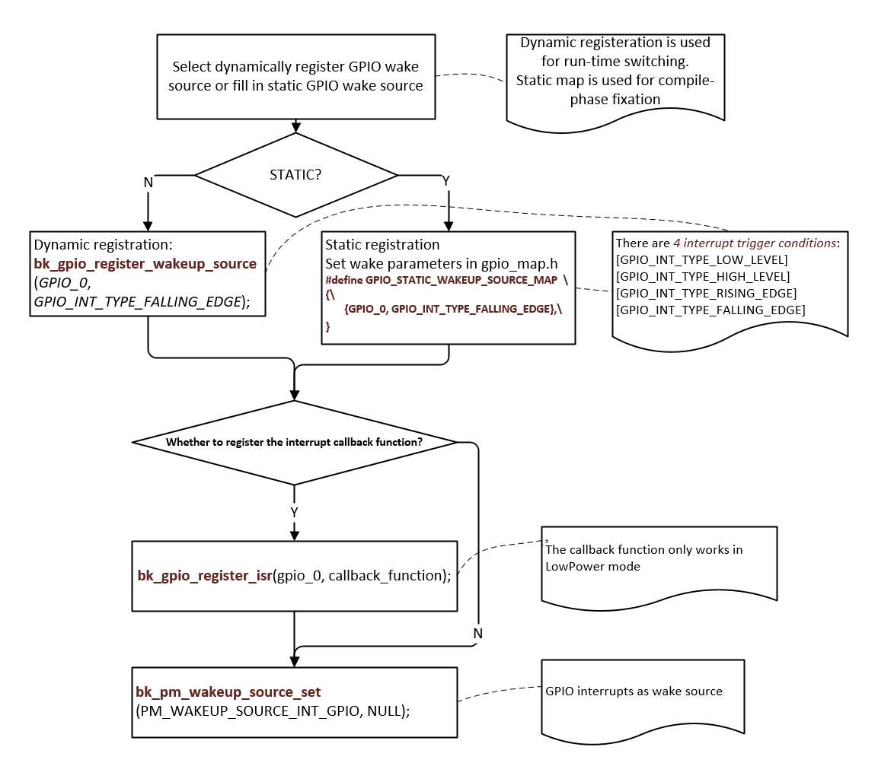

GPIO 使用指南
================

:link_to_translation:`en:[English]`

博通芯片支持丰富的 GPIO 引脚，不过有些GPIO引脚不能被应用程序所使用：

 - 在大多数博通芯片中，UART0 默认处于启用状态，GPIO 10 和GPIO 11 复用为UART0。
 - 一些 GPIO 引脚可能会被特定的外设所使用。如果某个设备通过软件被启用了，那么应用程序就不能使用该设备所使用的GPIO。例如，在 BK7258 芯片中，SPI-1 可以使用GPIO 2、GPIO 3、GPIO 4 和GPIO 5。如果SPI-1通过软件被启用了，应用程序就不能使用GPIO 2、GPIO 3、GPIO 4和GPIO 5；但如果SPI-1通过软件被禁用了，应用程序仍然可以使用GPIO 2、GPIO 3、GPIO 4和GPIO 5。

如果GPIO引脚已经被外设使用，那么像 bk_gpio_set_config（）这样的API将返回 GPIO_ERR_INTERNAL_USED 错误码。

一般来说，GPIO 用户可以按照以下步骤来使用 GPIO：

 - 阅读芯片硬件数据手册，以全面了解外设是如何使用GPIO引脚的。
 - 检查应用程序中已启用的外设，并找出这些设备所使用的GPIO。
 - 始终检查GPIO API的返回值，确保返回值不是 GPIO_ERR_INTERNAL_USED。

.. note::

  GPIO 实行分时复用，同一时刻仅可充当普通 GPIO 或使用其第二功能。

GPIO MAP Config
------------------
  gpio_map.h

  BK7258是多核AMP架构，在每个 CPU 核心驱动初始化过程中，GPIO会根据映射表（**GPIO_DEFAULT_DEV_CONFIG**）进行配置。该映射表中的每一行包含九个元素。
  这9个元素含义如下:

   - gpio_id：从 0 开始编号的对应GPIO引脚号。
   - second_func_en：是否启用第二功能。
   - second_func_dev:选择引脚的第二功能。（目前，单个GPIO引脚最多可复用八种第二功能，同一时间只能复用一个第二功能，详见 **GPIO_DEV_MAP**。该表格用户不可修改。）
   - io_mode：选择输入输出（IO）操作模式，包括输入模式、输出模式或高阻态。
   - pull_mode：选择GPIO的上拉或下拉模式。
   - int_en：是否开启中断。
   - int_type：选择触发中断的条件，包括高电平触发、低电平触发、上升沿触发、下降沿触发。
   - low_power_io_ctrl：低功耗模式下是否保持GPIO的输出状态或设置为唤醒源。（配置GPIO_LOW_POWER_KEEP_INPUT_STATUS可以将GPIO设置为唤醒源，若设为唤醒源，需要开启中断，配置中断类型。若未对该位进行设置，GPIO 在进入低功耗模式时GPIO将处于高阻状态）
   - driver_capacity：驱动能力选择，共有四个等级。

GPIO 部分使用介绍:
------------------
  
  1. 客户需要根据其开发板的配置需求来配置 **GPIO_DEFAULT_DEV_CONFIG** 表。您可以依据 **GPIO_DEV_MAP** 表中定义的每个 GPIO 的功能，自由地配置 **GPIO_DEFAULT_DEV_CONFIG** 表。
     如果您想在程序运行期间更改某个 GPIO 的功能，可以使用 gpio_dev_unmap() 函数取消原有的映射，然后使用 gpio_dev_map() 函数进行新的映射。 
  2. 目前，BK7258 基于非对称多处理（AMP）架构，这会导致 GPIO 中断由多个 CPU 核心处理，影响程序的预期运行表现（CPU1 的时钟速度高于 CPU0，CPI1清除了GPIO的中断状态位，CPU0无法检测到该中断，会导致中断丢失）。为解决该问题，提出以下解决办法：

    - 通过采用第3点，为每个 CPU 核心定义 **GPIO_DEFAULT_DEV_CONFIG** 表，将不同的 GPIO 分配给不同的核心。这样每个 CPU 核心将仅响应其对应映射表中的中断，从而避免多个核心处理同一个中断，确保程序按预期运行。

  3. 以自定义方式覆盖默认的 **GPIO_DEFAULT_DEV_CONFIG** 时，可按以下步骤操作：
    
    - 打开宏定义：在项目配置文件中开启 CONFIG_USR_GPIO_CFG_EN 宏，以启用自定义 GPIO 配置功能。
    - 创建 usr_gpio_cfg.h 文件：在项目的合适位置创建 usr_gpio_cfg.h 头文件，并在该文件中定义你自定义的 GPIO_DEFAULT_DEV_CONFIG。此配置应包含你所需的所有 GPIO 的初始化设置和映射关系。如 bk_avdk_release\\projects\\lvgl\\86box\\config\\bk7258 所示。
      
     需要注意的是，新映射的功能必须已在 **GPIO_DEV_MAP** 表中定义。在初始化过程中，芯片会根据 **GPIO_DEFAULT_DEV_CONFIG** 表来配置 GPIO 的状态。（注意：确保在代码中包含 usr_gpio_cfg.h 文件，这样在编译时就会使用你自定义的 GPIO 配置。）
     
  4. 低功耗状态：在低功耗状态下，GPIO 可配置为输入模式（唤醒源）和输出模式。如果在低功耗期间不使用相应的 GPIO（GPIO_LOW_POWER_DISCARD_IO_STATUS），低功耗模式程序会将该 GPIO 设置为高阻状态，以防止在低功耗模式下出现漏电现象。
  5. 当你需要在低功耗模式下保持 GPIO 的输出状态时，有两种办法设置：

    - 按照说明配置 **GPIO_DEFAULT_DEV_CONFIG** 表。
    - 使用bk_gpio_register_lowpower_keep_status() 函数注册。目前默认数量为4，可使用CONFIG_GPIO_DYNAMIC_KEEP_STATUS_MAX_CNT修改数量）

  6. 当进入低功耗模式时，可以将多个外部 GPIO 设置为唤醒源。如果任何一个 GPIO 产生中断信号，芯片就能从低功耗模式中唤醒。目前有三种办法设置为唤醒源：

    - 按照说明配置 **GPIO_DEFAULT_DEV_CONFIG** 表。
    - **GPIO_STATIC_WAKEUP_SOURCE_MAP** 中设置多个唤醒源。
    - 使用 bk_gpio_register_wakeup_source（）函数注册。（目前默认数量为4，可使用CONFIG_GPIO_DYNAMIC_WAKEUP_SOURCE_MAX_CNT修改数量）

  7. 当进入低功耗模式（仅适用于低压情况）时，GPIO 的状态将被备份。退出低功耗模式后，GPIO 会自动恢复到进入该模式之前的状态。
     （**note**：从深度睡眠模式退出后，相当于进行了一次软重启，GPIO 状态不会自动恢复。）
  
   

.. note::
   
    - usr_gpio_cfg.h 必须被配置。
    - GPIO 的驱动能力如下表所示。REG 表示 GPIO 寄存器的设置值，驱动能力共有四个等级。 
        +-------+------+--------+--------+---------+
        |       | REG=2| REG=102| REG=202| REG=302 |
        +=======+======+========+========+=========+
        | P14   | 10.49| 19.95  | 33.72  | 40.8    |
        +-------+------+--------+--------+---------+
        | P15   | 10.48| 19.9   | 33.28  | 40.03   |
        +-------+------+--------+--------+---------+
        | P16   | 10.41| 19.65  | 32.76  | 39.35   |
        +-------+------+--------+--------+---------+
        | P17   | 10.36| 19.45  | 32.26  | 38.6    |
        +-------+------+--------+--------+---------+
         
                  - 高电平拉电流(mA)

        +-------+------+--------+--------+---------+
        |       | REG=0| REG=100| REG=200| REG=300 |
        +=======+======+========+========+=========+
        | P14   | 8.54 | 16.09  | 26.05  | 32      |
        +-------+------+--------+--------+---------+
        | P15   | 8.56 | 16.19  | 26.47  | 32.6    |
        +-------+------+--------+--------+---------+
        | P16   | 8.56 | 16.35  | 26.87  | 33.24   |
        +-------+------+--------+--------+---------+
        | P17   | 8.62 | 16.5   | 27.24  | 33.85   |
        +-------+------+--------+--------+---------+

                 - 低电平灌电流(mA)

 

Example: 

GPIO_0 配置为 [GPIO_DEV_I2C1_SCL] 功能，将 GPIO_1 配置为 [GPIO_DEV_I2C1_SDA] 功能：
	+---------+-------------------------+-------------------+-----------------+------------------+-----------------+------------------------+---------------------------------+-----------------------+
	| gpio_id |     second_func_en      |  second_func_dev  |    io_mode      |     pull_mode    |     int_en      |        int_type        |          low_power_io_ctrl      |    driver_capacity    |
	+=========+=========================+===================+=================+==================+=================+========================+=================================+=======================+
	| GPIO_0  | GPIO_SECOND_FUNC_ENABLE | GPIO_DEV_I2C1_SCL | GPIO_IO_DISABLE | GPIO_PULL_UP_EN  | GPIO_INT_DISABLE| GPIO_INT_TYPE_LOW_LEVEL| GPIO_LOW_POWER_DISCARD_IO_STATUS| GPIO_DRIVER_CAPACITY_3|
	+---------+-------------------------+-------------------+-----------------+------------------+-----------------+------------------------+---------------------------------+-----------------------+
	| GPIO_1  | GPIO_SECOND_FUNC_ENABLE | GPIO_DEV_I2C1_SDA | GPIO_IO_DISABLE | GPIO_PULL_UP_EN  | GPIO_INT_DISABLE| GPIO_INT_TYPE_LOW_LEVEL| GPIO_LOW_POWER_DISCARD_IO_STATUS| GPIO_DRIVER_CAPACITY_3|
	+---------+-------------------------+-------------------+-----------------+------------------+-----------------+------------------------+---------------------------------+-----------------------+
	 
	 - PS：当使用 GPIO 的第二功能时，GPIO 默认处于关闭状态（输入输出模式 io_mode 为 [GPIO_IO_DISABLE]）。I2C 需要更强的驱动能力（驱动能力 driver_capacity 设为 [GPIO_DRIVER_CAPACITY_3]）

GPIO_0 被设置为高阻态（默认状态）：
	+---------+-------------------------+-------------------+-----------------+------------------+-----------------+------------------------+---------------------------------+-----------------------+
	| gpio_id |     second_func_en      |  second_func_dev  |    io_mode      |     pull_mode    |     int_en      |        int_type        |          low_power_io_ctrl      |    driver_capacity    |
	+=========+=========================+===================+=================+==================+=================+========================+=================================+=======================+
	| GPIO_0  | GPIO_SECOND_FUNC_DISABLE| GPIO_DEV_INVALID  | GPIO_IO_DISABLE | GPIO_PULL_DISABLE| GPIO_INT_DISABLE| GPIO_INT_TYPE_LOW_LEVEL| GPIO_LOW_POWER_DISCARD_IO_STATUS| GPIO_DRIVER_CAPACITY_0|
	+---------+-------------------------+-------------------+-----------------+------------------+-----------------+------------------------+---------------------------------+-----------------------+
	  
	  - PS：禁用所有配置

GPIO_0 设置为输入模式，并配置为下降沿触发中断：
	+---------+-------------------------+-----------------+-----------------+----------------+----------------+--------------------------+----------------------------------+-----------------------+
	| gpio_id |     second_func_en      |  second_func_dev|    io_mode      |    pull_mode   |     int_en     |         int_type         |          low_power_io_ctrl       |    driver_capacity    |
	+=========+=========================+=================+=================+================+================+==========================+==================================+=======================+
	| GPIO_0  | GPIO_SECOND_FUNC_DISABLE| GPIO_DEV_INVALID|GPIO_INPUT_ENABLE| GPIO_PULL_UP_EN| GPIO_INT_ENABLE|GPIO_INT_TYPE_FALLING_EDGE| GPIO_LOW_POWER_DISCARD_IO_STATUS | GPIO_DRIVER_CAPACITY_0|
	+---------+-------------------------+-----------------+-----------------+----------------+----------------+--------------------------+----------------------------------+-----------------------+
	  
	  - PS：关闭第二功能。有 4 种中断触发条件：低电平触发、高电平触发、上升沿触发、下降沿触发

GPIO_0 作为低功耗唤醒源，下降沿唤醒：
	+---------+-------------------------+-----------------+-----------------+----------------+----------------+--------------------------+----------------------------------+-----------------------+
	| gpio_id |     second_func_en      |  second_func_dev|    io_mode      |    pull_mode   |     int_en     |         int_type         |          low_power_io_ctrl       |    driver_capacity    |
	+=========+=========================+=================+=================+================+================+==========================+==================================+=======================+
	| GPIO_0  | GPIO_SECOND_FUNC_DISABLE| GPIO_DEV_INVALID|GPIO_INPUT_ENABLE| GPIO_PULL_UP_EN| GPIO_INT_ENABLE|GPIO_INT_TYPE_FALLING_EDGE| GPIO_LOW_POWER_KEEP_INPUT_STATUS | GPIO_DRIVER_CAPACITY_0|
	+---------+-------------------------+-----------------+-----------------+----------------+----------------+--------------------------+----------------------------------+-----------------------+
	  
	  - PS：low_power_io_ctrl 设置为 [GPIO_LOW_POWER_KEEP_INPUT_STATUS]

GPIO API Status
------------------

+----------------------------------------------+---------+------------+
| API                                          | BK7258  | BK7258_cp1 |
+==============================================+=========+============+
| :cpp:func:`bk_gpio_driver_init`              | Y       | Y          |
+----------------------------------------------+---------+------------+
| :cpp:func:`bk_gpio_driver_deinit`            | Y       | Y          |
+----------------------------------------------+---------+------------+
| :cpp:func:`bk_gpio_enable_output`            | Y       | Y          |
+----------------------------------------------+---------+------------+
| :cpp:func:`bk_gpio_disable_output`           | Y       | Y          |
+----------------------------------------------+---------+------------+
| :cpp:func:`bk_gpio_enable_input`             | Y       | Y          |
+----------------------------------------------+---------+------------+
| :cpp:func:`bk_gpio_disable_input`            | Y       | Y          |
+----------------------------------------------+---------+------------+
| :cpp:func:`bk_gpio_enable_pull`              | Y       | Y          |
+----------------------------------------------+---------+------------+
| :cpp:func:`bk_gpio_disable_pull`             | Y       | Y          |
+----------------------------------------------+---------+------------+
| :cpp:func:`bk_gpio_pull_up`                  | Y       | Y          |
+----------------------------------------------+---------+------------+
| :cpp:func:`bk_gpio_pull_down`                | Y       | Y          |
+----------------------------------------------+---------+------------+
| :cpp:func:`bk_gpio_set_output_high`          | Y       | Y          |
+----------------------------------------------+---------+------------+
| :cpp:func:`bk_gpio_set_output_low`           | Y       | Y          |
+----------------------------------------------+---------+------------+
| :cpp:func:`bk_gpio_get_input`                | Y       | Y          |
+----------------------------------------------+---------+------------+
| :cpp:func:`bk_gpio_set_config`               | Y       | Y          |
+----------------------------------------------+---------+------------+
| :cpp:func:`bk_gpio_register_isr`             | Y       | Y          |
+----------------------------------------------+---------+------------+
| :cpp:func:`bk_gpio_enable_interrupt`         | Y       | Y          |
+----------------------------------------------+---------+------------+
| :cpp:func:`bk_gpio_disable_interrupt`        | Y       | Y          |
+----------------------------------------------+---------+------------+
| :cpp:func:`bk_gpio_set_interrupt_type`       | Y       | Y          |
+----------------------------------------------+---------+------------+

Application Example
------------------------------------

DEMO1:
	  GPIO_0 as wake-up source for DeepSleep or LowPower, pseudo code description and interpretation.

    Figure 1. GPIO as wake-up source for DeepSleep or LowPower

GPIO API Reference
---------------------

.. include:: ../../_build/inc/gpio.inc

GPIO API Typedefs
---------------------
.. include:: ../../_build/inc/gpio_types.inc

