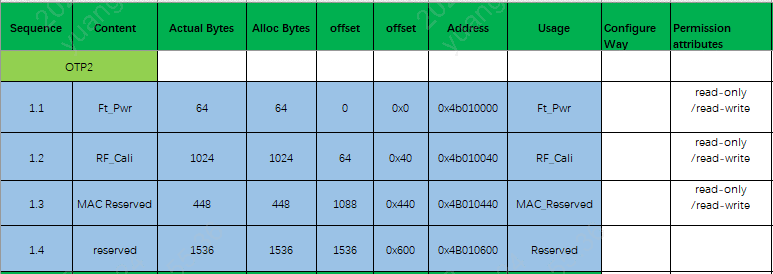
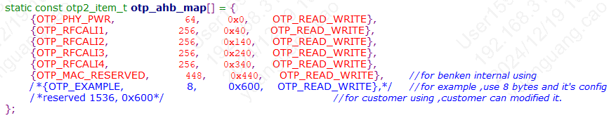

.. _bk_nosecure_version_of_otp_usage_instructions:

非安全版本OTP使用介绍
===========================

:link_to_translation:`en:[English]`

OTP
-----------------------------------------------------------

一、概述
+++++++++++++++++++++++++++++

OTP的详细概述，详情请参考 :ref:`OTP/EFUSE配置 <bk_config_otp_efuse>`。

.. note::

 其中，客户可使用的OTP区域仅有OTP2的存储空间，且操作存储地址区间是[0x4B010600----0x4B010C00]，大小是1.5k字节空间。

OTP2的使用布局
~~~~~~~~~~~~~~~~

OTP2 Side
~~~~~~~~~~~~~~~~
OTP2:可读可编程的OTP2区域，0x000~0x2FF被分为767个小分区。其存储地址区间是[0x4B010000----0x4B010C00]每个分区都可以通过改变LOCK OTP2 CELL来更改权限：读写->只读->不可访问。

.. important::

 其中，前1.5k字节大小空间已被BEKEN内部使用，其存储地址区间是[0x4B010000----0x4B010600],客户不予使用; 客户可操作的存储地址区间是[0x4B010600----0x4B010C00]，大小是1.5k字节空间。

二、Otp2的驱动使用介绍
+++++++++++++++++++++++++++++

- 1）首先，otp2的驱动代码路径在bk_idk/middleware/driver/otp/otp_driver_v1_1.c；
- 2）客户如果想使用otp2，需要配置结构体数组中otp_ahb_map[]的{ name,  allocated_size ,  offset ,  privilege }即可；
- 3）其中，name字段，需要在枚举结构otp2_id_t中按顺序增加相应的字段即可；
- 3）配置好上述的配置之后，可以使用cli命令进行测试, 相关的测试代码路径是：bk_idk/component/bk_cl/cli_otp.c  (例如 测试命令是otp_ahb read item size)

.. note::

    操作写otp2某个区域之前，最好将该区域读出来确认一下，确认该otp区域是否已经被使用过。（otp原始值是0）

结构体数组otp_ahb_map配置介绍
~~~~~~~~~~~~~~~~~~~~~~~~~~~~~~~~

- 1）结构体数组otp_ahb_map的结构体如下：具体路径是bk_idk/middleware/driver/otp/otp_driver.h

.. figure:: picture/otp_item.png
    :align: center
    :alt: 8
    :figclass: align-center

.. note::

    - name：访问区域的item_id,后续操作该区域可根据该item_id进行访问d_size的大小，即所需要分配的字节大小空间；
    - allocated_size：分配的字节大小空间
    - offset：相对基地址的偏移量
    - privilege：设定访问区域的权限

- 2）otp2_id_t中按顺序增加相应的name字段即可；具体路径是include/driver/otp_types.h

- 3）目前，otp2的使用区域情况如下：具体路径是bk_idk/middleware/driver/otp/otp_driver_v1_1.c

.. note::

     - 以name=OTP_EXAMPLE举例介绍如何配置otp2，
     - 首先，在otp2_id_t结构中中增加自行定义的name字段，如OTP_EXAMPLE；
     - 其次，配置allocated_size的大小，即所需要分配的字节大小空间；（十进制大小）
     - offset大小等于（前一个name字段的allocated_size + 前一个字段的offset） （十六进制）