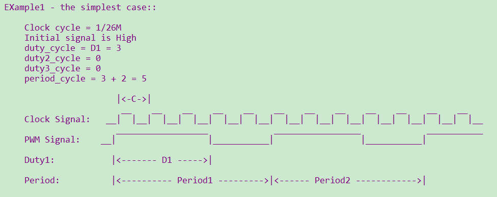

PWM
==========================

:link_to_translation:`en:[English]`

1 功能概述
----------------------------------------------------------------------------------------------------------------------------------------------------
	BK7258总共有2组PWM，每1组6个channel。

	1、每组 PWM 的 CH0, CH1, CH2, CH4 可用作独立输出。

	2、每组 PWM 可实现3个互补输出，如概述中的表格所示，仅可配置 PWMx 的 CH0与CH1, CH2与CH3, CH4与CH5 作为互补输出，
	有相应的死区相关的寄存器可配置，较为精准，但通道固定。

	3、PWM1 的 CH0, CH2, CH4 与 PWM2 的 CH0, CH2, CH4 任意两通道组成互补输出，软件实现互补功能，较为灵活，但精度不及硬件实现的方式。

	4、另外要应用到灯或电机时，P8/P22，p9/P23不建议使用。

	bk7258具有12路PWM输出，输出时其时钟源选择的是26M，每一路的周期及占空比可以进行配置，channel如下:

	+-------------------+----------------+-----------------+-------------+
	|     channel       |     GPIO       |    channel      |     GPIO    |
	+===================+================+=================+=============+
	|      0            |  GPIO6/GPIO18  |      6          |    GPIO32   |
	+-------------------+----------------+-----------------+-------------+
	|      1            |  GPIO7/GPIO19  |      7          |    GPIO33   |
	+-------------------+----------------+-----------------+-------------+
	|      2            |  GPIO8/GPIO22  |      8          |    GPIO34   |
	+-------------------+----------------+-----------------+-------------+
	|      3            |  GPIO9/GPIO23  |      9          |    GPIO35   |
	+-------------------+----------------+-----------------+-------------+
	|      4            |     GPIO24     |      10         |    GPIO36   |
	+-------------------+----------------+-----------------+-------------+
	|      5            |     GPIO25     |      11         |    GPIO37   |
	+-------------------+----------------+-----------------+-------------+

    注：支持多个GPIO时，请注意默认PWM 通道对应的GPIO配置，配置文件在gpio_map.h GPIO_PWM_MAP_TABLE

2 代码路径
-------------------------------------
	demo路径：``components\bk_cli\cli_pwm.c``

3 cli命令简介
-------------------------------------

	demo运行依赖的宏配置：

	+--------------------------------------+------------------------+--------------------------------------------+---------+
	|                 NAME                 |      Description       |                  File                      |  value  |
	+======================================+========================+============================================+=========+
	| CONFIG_PWM                           | support PWM            | ``middleware\soc\bk7258\bk7258.defconfig`` |    y    |
	+--------------------------------------+------------------------+--------------------------------------------+---------+

	demo支持的命令如下表：

	+----------------------------------------+----------------------------------+---------------------------------------+
	|             Command                    |            Param                 |              Description              |
	+========================================+==================================+=======================================+
	| pwm_driver init {26M|DCO}              | 26M|DCO:clk source,default 26M   |  init the resoure common to all PWM   |
	|                                        |                                  |  channels                             |
	+----------------------------------------+----------------------------------+---------------------------------------+
	| pwm_driver deinit                      | none                             | free all resource related to pwm      |
	+----------------------------------------+----------------------------------+---------------------------------------+
	|                                        | chan: pwm channel                |                                       |
	|                                        +----------------------------------+                                       |
	|                                        | period_v:pwm periord             | power up and config the pwm channel,  |
	|                                        +----------------------------------+ set the period and duty cycle         |
	| pwm {chan} init {period_v} {duty_v}    | duty_v: duty cycle               |                                       |
	|                                        +----------------------------------+ note: this chip supports 3 duty cycle |
	| [duty2_v][duty3_v]                     | duty2_v: second level reversal   | , parameter duty2_v and duty3_v are   |
	|                                        +----------------------------------+ optional                              |
	|                                        | duty3_v: third level reversal    |                                       |
	+----------------------------------------+----------------------------------+---------------------------------------+
	|                                        | chan: pwm channel                |                                       |
	|                                        +----------------------------------+                                       |
	|                                        | period_v:pwm periord             | configure the period and duty cycle.  |
	|                                        +----------------------------------+                                       |
	| pwm {chan} duty {period_v} {duty_v}    | duty_v: duty cycl                |                                       |
	|                                        +----------------------------------+                                       |
	| [duty2_v] [duty3_v]                    | duty2_v: second level reversal   | note: parameter duty2_v and duty3_v   |
	|                                        +----------------------------------+ are option.                           |
	|                                        | duty3_v: third level reversal    |                                       |
	+----------------------------------------+----------------------------------+---------------------------------------+
	|                                        | chan: pwm channel                |                                       |
	| pwm {chan} {start|stop|deinit}         +----------------------------------+ read data_size bytes of data from     |
	|                                        | start|stop|deinit:               |                                       |
	+----------------------------------------+----------------------------------+---------------------------------------+
	|                                        | chan: pwm channel                |                                       |
	| pwm {chan} signal {low|high}           +----------------------------------+  set the initial signal to high|low   |
	|                                        | low|high: initial signal level   |                                       |
	+----------------------------------------+----------------------------------+---------------------------------------+
	|                                        | chan1: pwm channel               |                                       |
	|                                        +----------------------------------+ init the PWM group                    |
	|                                        | chan2: pwm channel               |                                       |
	|                                        +----------------------------------+ The PWM group is a channel pair that  |
	| pwm_group init {chan1} {chan2}         | period: pwm periord              | has following attributes:             |
	|                                        +----------------------------------+ -The period is same                   |
	| {period} {chan1_duty} {chan2_duty}     | chan1_duty: chan1 duty cycle     | -The initial signal level is opposite |
	|                                        +----------------------------------+ -Start and stop at the same time      |
	|                                        | chan2_duty: chan2 duty cycle     |                                       |
	+----------------------------------------+----------------------------------+---------------------------------------+
	|                                        | chan: pwm channel                |                                       |
	| pwm_group {start|stop|deinit}          +----------------------------------+ start|stop|deinit the PWM group       |
	|                                        | start|stop|deinit:               |                                       |
	+----------------------------------------+----------------------------------+---------------------------------------+
	|                                        | group: pwm channel               |                                       |
	|                                        +----------------------------------+                                       |
	|                                        | period: pwm periord              | Configure the duty and period of      |
	| pwm_group config {group} {period}      +----------------------------------+ a PWM group                           |
	|                                        | chan1_duty: chan1 duty cycle     |                                       |
	| {chan1_duty} {chan2_duty}              +----------------------------------+                                       |
	|                                        | chan2_duty: chan2 duty cycle     |                                       |
	+----------------------------------------+----------------------------------+---------------------------------------+
	|                                        | chan: pwm channel                |                                       |
	| pwm_capture {chan} init {pos|neg|edge} +----------------------------------+ calculate the cycles between two      |
	|                                        | pos|neg|edge: counting mode      | different pos-edge|neg-edge|edges     |
	+----------------------------------------+----------------------------------+---------------------------------------+
	|                                        | chan: pwm channel                |                                       |
	| pwm_capture {chan} {start|stop|deinit} +----------------------------------+ start|stop|deinit pwm capture func    |
	|                                        | start|stop|deinit                |                                       |
	+----------------------------------------+----------------------------------+---------------------------------------+

4 演示介绍
-------------------------------------
	demo执行的步骤如下：

1、准备好逻辑分析仪，连接方式如下：

   ::

		pwm通道0----GPIO18

		pwm通道1----GPIO19

2、PWM独立输出模式

	对PWM驱动进行初始化：

	   ::

		pwm_driver init

2.1 普通输出

	   ::

		pwm 0 init 200 100 0 0 25 //占空比50%
		pwm 0 start

波形如下：

    Figure 1. 输出60%占空比的PWM

.. note::

	注意：根据参数的配置，在相同周期内，占空比可以进行调整。但每次调整配置都在下一个周期才会生效；
	在PWM进行init和duty设置时，必须 period > (D1+D2+D3)。

